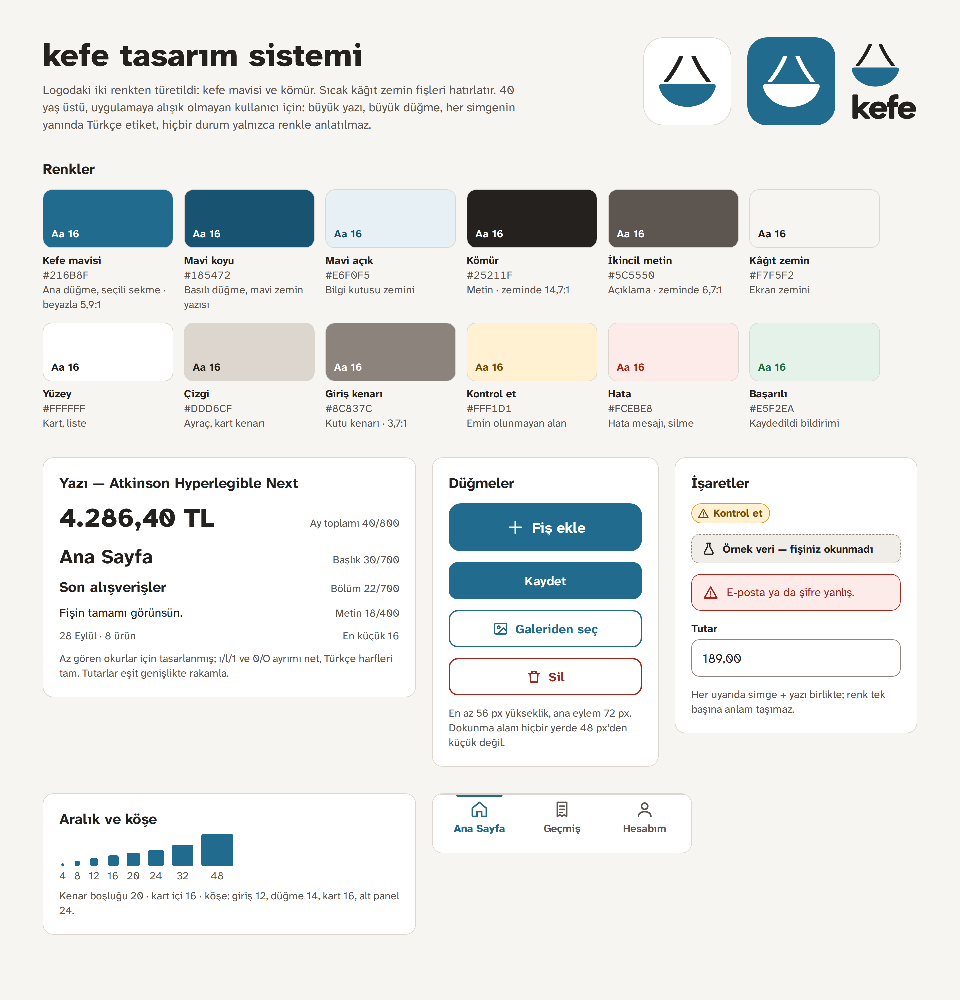

# kefe — visual design

The look of the consumer app and the admin, derived from the owner's logo
(2026-09-30). The build phase implements screens from this file, the
tokens in [`tokens.json`](tokens.json) and the screen images in
[`screens/`](screens). The editable source of every screen is the design
canvas "kefe arayüz tasarımı" on claude.ai (owner's account,
https://claude.ai/artifact/TiLjwd3KUkvURc475xW34R); the PNGs here are
renders of it. Decisions that constrain the future: ADR-0003.

## Principles

The user is a first-time app user, often 40+ (PRD, User). Every rule
below serves "no learning needed":

1. **One obvious next step per screen.** One primary (filled blue) button;
   everything else is outlined or a text link. "Fiş ekle" is the only
   hero button (72 pt) in the app.
2. **Big and plain.** Body 18, nothing under 16, key figures 24+, the
   month total 40. Buttons 56 pt tall, touch targets never under 48.
3. **Words beside every icon.** The tab bar, back buttons and every action
   carry a visible Turkish label (PRD #12). Back buttons name where they
   go ("Geçmiş", "Kontrol et"), not just "Geri".
4. **Never colour alone.** Every state pairs a colour with an icon and a
   word: "Kontrol et" (amber pill + triangle), errors (red box + triangle +
   sentence), consent ("Kapalı" written under the switch), price change
   ("%20 arttı" + arrow).
5. **Calm about prices.** A price change is shown in ink, not red or
   green, with the sentence "Bunlar sizin ödediğiniz fiyatlardır. Bugünkü
   raf fiyatı farklı olabilir." (PRD Problem: never judge a price).
6. **Paper and ink.** A warm paper background (`#F7F5F2`) with white
   cards echoes a receipt; the logo's blue is the only accent.

## Logo

- `logo/mark.svg` — the scale-pan mark redrawn as vector (strokes
  `#25211F`, bowl `#216B8F`). Use it in the app header and the admin
  sidebar.
- `logo/wordmark.png`, `logo/lockup.png`, `logo/mark.png` — cut from the
  owner's original image with a transparent background. The wordmark
  stays an image; it is never set in the UI font.
- App icon: the mark on white (as the owner's image shows), 20% padding.
  A blue-background variant with a white mark is on the canvas if a
  stronger icon is wanted.

## Colour

All pairs are checked against WCAG AA (4.5:1 for text, 3:1 for input
borders).

| Token            | Hex       | Use                               | Contrast            |
| ---------------- | --------- | --------------------------------- | ------------------- |
| `primary`        | `#216B8F` | Primary button, active tab, links | white on it 5.9:1   |
| `primaryPressed` | `#185472` | Pressed button, text on tint      | on tint 7.1:1       |
| `primaryTint`    | `#E6F0F5` | Hint box, icon circles            |                     |
| `text`           | `#25211F` | All body text                     | on background 14.7  |
| `textMuted`      | `#5C5550` | Secondary lines, captions         | on background 6.7:1 |
| `background`     | `#F7F5F2` | Screen                            |                     |
| `surface`        | `#FFFFFF` | Cards, lists, inputs, bars        |                     |
| `border`         | `#DDD6CF` | Dividers, card edges (decorative) |                     |
| `borderStrong`   | `#8C837C` | Input borders, switch off         | on white 3.7:1      |
| `attention.*`    | amber     | "Kontrol et", total mismatch      | fg on bg 6.7:1      |
| `danger.*`       | red       | Errors, delete                    | fg on bg 6.4:1      |
| `success.*`      | green     | "Kaydedildi" confirmation         | fg on bg 5.8:1      |

Category bars use `primary` for every category; categories are told
apart by their written name and amount, never by colour.

## Type

**Atkinson Hyperlegible Next** (Braille Institute, SIL OFL), weights 400,
600, 700 and 800. It was drawn for low-vision readers: `ı l 1 I` and
`0 O` are distinct, and it covers every Turkish letter. Amounts use
tabular figures. Scale in `tokens.json` → `text`; the month total is the
only 40 pt text. The PRD's "key figures 18–24" is read as a floor: totals
and amounts are 18–26, the month total 40.

The receipt's raw line ("Fişte yazan") and admin error codes use the
system monospace.

Dynamic Type / browser zoom: sizes are the default; layouts use no fixed
heights for text, so at 200% text rows grow and wrap (ROADMAP v1 12).

## Components

| Component     | Spec                                                                                                                          |
| ------------- | ----------------------------------------------------------------------------------------------------------------------------- |
| Button        | 56 tall, radius 14, 19/700. Primary filled blue; secondary white with 2 px blue border; danger white with 2 px red border.    |
| Hero button   | "Fiş ekle" only: 72 tall, radius 18, 22/700, plus icon 30.                                                                    |
| Text button   | Blue 18/700, 48 tall hit area (Vazgeç, Tümü, Şifremi unuttum).                                                                |
| Back button   | Chevron + the name of the screen it returns to, 18/700 blue, top-left.                                                        |
| Input         | 56 tall, radius 12, 1.5 px `borderStrong`, 19 text, label above in 16/700. Error: 2 px red border + red alert box above.      |
| Card          | White, 1 px `border`, radius 16, padding 16.                                                                                  |
| List row      | ≥ 64 tall; title 18/700, subtitle 16 muted, amount 18/700 right-aligned, chevron. Whole row is the tap target.                |
| Month picker  | 56 tall card: ‹ previous · "Eylül 2026" · next ›, both arrows labelled for screen readers ("Önceki ay", "Sonraki ay").        |
| Tab bar       | 88 tall, three tabs with 28 icon + 16 label; active tab blue 800 with a 4 px top bar. Ana Sayfa · Geçmiş · Hesabım.           |
| "Kontrol et"  | Amber pill: triangle icon + "Kontrol et", 16/700. Sits under the item name or beside a field label.                           |
| Sample banner | "Örnek veri — fişiniz okunmadı": dashed `borderStrong` box on `surfaceMuted`, flask icon. Top of every screen with mock data. |
| Alert         | Icon + bold first sentence + plain second sentence; amber for "check this", red for errors.                                   |
| Bottom sheet  | Radius 24 top, grab handle, scrim `rgba(37,33,31,.55)`. Used for "Fiş ekle".                                                  |
| Dialog        | Centered card radius 20, icon circle, title 22/700, safe action primary.                                                      |
| Switch        | 60×36; off = grey with "Kapalı" written under it, on = blue with "Açık".                                                      |

Icons: 24 px line icons, 2 px stroke, rounded ends (the canvas uses
inline SVG; the build may use any set with the same weight, as long as
every icon keeps its label).

## Screens

Each screen maps to a PRD interaction and a ROADMAP item. Copy on the
images is the intended Turkish copy.

| Image                                | Screen                                         | PRD   | ROADMAP           |
| ------------------------------------ | ---------------------------------------------- | ----- | ----------------- |
| [01](screens/01-Giris.png)           | Giriş                                          | 1     | skeleton 4        |
| [02](screens/02-Giris-hata.png)      | Giriş — wrong password                         | 1     | skeleton 4        |
| [03](screens/03-AnaSayfa-bos.png)    | Ana Sayfa — empty state                        | 2     | v1 3              |
| [04](screens/04-AnaSayfa.png)        | Ana Sayfa (scrolled full length)               | 2     | skeleton 5, v1 3  |
| [05](screens/05-FisEkle.png)         | Fiş ekle — camera or gallery sheet             | 3     | skeleton 5, v1 10 |
| [06](screens/06-Onizleme.png)        | Photo preview — Gönder / Tekrar fotoğraf çek   | 3     | v1 10             |
| [07](screens/07-FisOkunuyor.png)     | "Fiş okunuyor" waiting state (only text)       | 4     | skeleton 5, v1 2  |
| [08](screens/08-KontrolEt.png)       | Kontrol et — mock label, mismatch, unsure row  | 5, 11 | skeleton 5, v1 1  |
| [09](screens/09-KalemDuzenle.png)    | Item edit — name and amount first              | 5     | v1 1              |
| [09b](screens/09b-DigerBilgiler.png) | Item edit — "Diğer bilgiler" open              | 5     | v1 1              |
| [10](screens/10-Okunamadi.png)       | Read failed — "Tekrar dene"                    | 4     | v1 2              |
| [11](screens/11-AyniFis.png)         | Duplicate warning                              | 6     | v1 2              |
| [12](screens/12-Gecmis.png)          | Geçmiş — search, month, list                   | 7     | v1 4              |
| [13](screens/13-FisDetay.png)        | Receipt detail — photo, items, edit, delete    | 7, 9  | v1 4, v1 5        |
| [14](screens/14-FiyatGecmisi.png)    | Product price history                          | 8     | v1 8              |
| [15](screens/15-Hesabim.png)         | Hesabım — privacy, consent off, sign out       | 10    | skeleton 4, v1 9  |
| [16](screens/16-Admin.png)           | Admin overview (read-only, placeholder counts) | 14    | v1 13             |

Notes per screen that the images cannot show:

- **Kontrol et** scrolls; "Kaydet" is pinned to the bottom. "Vazgeç"
  leaves without saving (the draft never counts).
- **Item edit**: "Diğer bilgiler" is closed by default and shows the
  "Kontrol et" pill while closed if any hidden field is unsure. An
  unreadable brand is an empty field with the placeholder "Fişte
  okunamadı", never a guess.
- **Fiş okunuyor** shows only the mark and "Fiş okunuyor" with three
  pulsing dots; no state name, no step counter (PRD #4).
- **Duplicate warning**: the safe choice "Kaydetme" is primary; "Yine de
  kaydet" is secondary. Nothing is deleted.
- **Price history**: the change box appears only when core returns a
  comparison; otherwise the box is absent and only the rows show.
- **Hesabım**: "Hesabımı sil" is a red text button at the bottom, far
  from "Çıkış yap", and opens a confirmation dialog (not drawn).
- **Admin**: internal state names appear only here. Receipt content and
  personal data are never shown. Counts on the image are placeholders.

## Not drawn yet

Sign-up form, forgot-password, the privacy text page, delete-account
confirmation, the original-image viewer, month picker behaviour at the
first month, and the admin's catalog and observation tables. They reuse
the components above; draw them on the canvas when their ROADMAP item
starts if the layout is not obvious.
